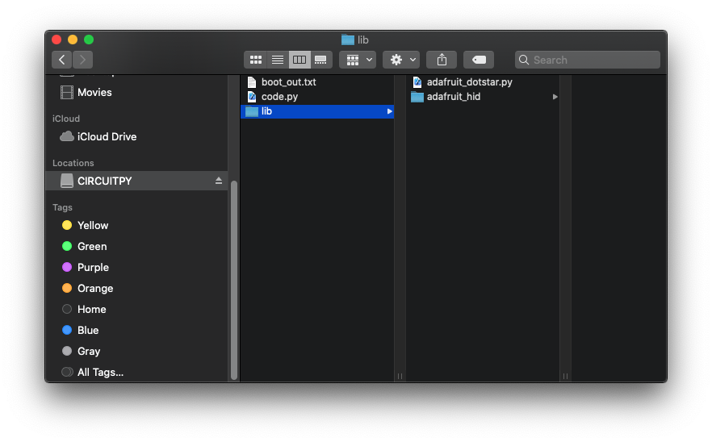
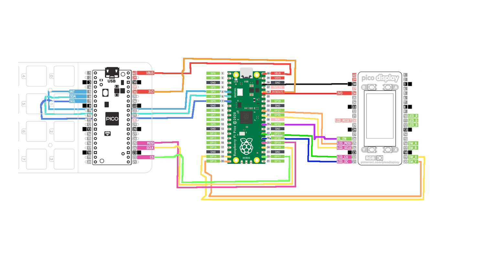

# PICO rgb HID keypad

### All files are in the repository because I know they work. I have also reference the authors so that updates may be located should this repository fall behind

# Steps for basic install

1. Flash your PICO with the Circuit Python uf2 file. [ORIGINAL FILE][UF2]
1. Download the Circuit Python bundle files. [adafruit-circuitpython-bundle-py-20210214.zip][BUNDLE_FILES]
  1. Create a `lib/` directory on your PICO
  1. Copy all `lib/adafruit_hid` folder to `CIRCUITPY/lib/`
  1. Copy the `lib/adafruit_dotstar.py` file to `CIRCUITPY/lib/adafruit_dotstar.py`



A big thank you to [wildestpixel][WILDESTPIXEL] and the [code they made][CODEPY] that formed a basis for this project. I recommend if you have issues with my `code.py` file to use theirs instead.

## Editing and running

- In [Thonny][THONNY], create and new file like [`code.py`][CODEPY] and save it to the PICO directory (`CIRCUITPY`)
- I have been using ATOM to do my editing, and the Arduino serial monitor to view any debug output from the Pico

## Notes:

1. This is in [CircuitPython][CIRCUITPYTHON], please use that as a basis for code questions.
1. Saving files to the `CIRCUITPY` folder will automatically trigger a restart and deploy `code.py`
1. Using the Arduino Serial Monitor to debug has been super useful and was a complete "by chance" discovery
1. This repo is going to be changing (hopefully) rapidly, I'm new to [Insert Brand Name Here]Python and electronics, my main experience in this area has been minor doses of nodejs on a Raspberry Pi.

# My repo

## Introduction

The aim of this is to eventually control a series of different button configurations, I have done some conferences on my [Android developer scripts][TALOS] and thought being able to control various aspects of my "automate-able" life using this little shiny thing will keep me somewhat warm on those long Covid nights.

The goal is to have the code that interfaces with the [Pico Board][PICO] plugged into the [Rainbow Pi Hat][KEYPAD] in the `code.py` file, and then have several classes that implement the specific behaviours that I want as separate "plug-ins." For example, I want to be able to control Microsoft Teams chats easier, these configurations can be found in the `teams.py` file. I have also been musing some DotA2 handiness, and that can be found in the `dota.py` file.

My [Android scripts][TALOS] are fairly specific and relate to the scripts that can be found [in my other repo][TALOS]. They need to be installed in a particular manner and since I'm still new to this I recommend just removing that for now.

If you want to see an example of what the keypad behaviours should do, please use `keypad.py` as the template, and `teams.py` as an example. Currently the 16th button is used to switch through states.

## Installation

1. Do a basic installation
1. Copy all my python scripts, including `code.py` to the `CIRCUITPY/` directory
1. Put your custom keypad configurations into the `CIRCUITPY/keyconfig` directory
1. Choose which configurations you want in [line 38][LINE38] of `code.py`, and use the 16th (bottom-right most) button to switch between them

### keypad configurations

Using the `keypad.py` file as a template, create the custom key mappings you would like to have. The `handleEvent(self, keyIndex, event)` method is the most important. The keyIndex is which key had the event, and the event is a combination state integer that defines what event occurred. Can be a combination of:
  - EVENT_SINGLE_PRESS
  - EVENT_DOUBLE_PRESS
  - EVENT_LONG_PRESS
  - EVENT_EXTRA_LONG_PRESS
  - EVENT_KEY_UP
  - EVENT_KEY_DOWN

I have started storing my custom configurations in a folder called `keyconfig/` for simplicity and structure. To manage configurations:
1. copy `keypad.py` as a new file, give the file a unique name, as well as the class.
2. modify the `handleEvent(self, keyIndex, event)` method to behave the way you want
3. OPTIONAL STEPS:
  - modify `introduce(self)` to perform an animation of your design on the buttons
  - alter `getKeyColours(self)` to define a two-dimensional array: `[0]` being the 'resting state' and `[1]` being the 'active' state
4. in `code.py`
  - import the configurations: `from keyconfig.[mynewconfig] import *`
  - ensure the array knows about your desired configurations and the order in which you want them to appear: `interfaces = [interfaceOne, interfaceTwo, interfaceThree, mynewconfig]`
  - The code is currently set up to have the default `keypad.py` as the initial interface. Modify this to be whichever interface you want to start with:

    ```
    ki = KeypadInterface(kbd, layout, setKeyColour)
    ki.introduce()
    ```

  - Inside the main loop, the behaviour to swap between layouts is currently defined as an EVENT_EXTRA_LONG_PRESS on the 16th button. This will invoke the `swapLayout()` method which iterates through your keypad interfaces
  - The `constants.py` file defines the default values, colours, and delay times.

### Pico Display

If you would like to use the [Pico Display Pack][PICO_DISPLAY] that I have set up, refer to the wiring diagram below. This is due to the keypad already using the `LCD_MOSI`, `LCD_SCLK`, `LCD_CS` and `LCD_DC` pins. Also because the library is in CircuitPython, the `reset` pin needs to be moved as well (CP has no knowledge of the Pico specifics).

1. Ensure you uncomment all the references to the picodisplay in the `code.py` file

  - `from picodisplay import *` imports the behvaiour and the custom wiring
  - all references to `picoDisplay.render(...)` to show the initial screen and when the layouts are swapped
2. include the `picodisplay.py` file and the `images/` directory. You will need to copy the other Adafruit `lib/` files across, namely

  - `adafruit_display_text/`: for rending text on the display
  - `adafruit_imageload/`: allows images to be loaded into memory for faster reference.

3. Read more about how to use the library [here][ADAFRUIT_DISPLAYIO]

# Case

Download the files for 3D Printing a case [from thingiverse][THINGIVERSE_CASE]

# External libraries

1. [Adafruit Hardware Interface Device (HID)][ADAFRUIT_HID] - making the board behave like a keyboard
1. [Adafruit HID keycodes][ADAFRUIT_HID_CODES] - quick reference for default key values
1. [Adafruit Circuit Python displayio library][ADAFRUIT_DISPLAYIO]

# My ever-growing todo list

## General

1. :ballot_box_with_check: Make colours one value instead of a tuple, convert when needed
1. :black_square_button: Modularise the code for the pimoroni keypad
  - :ballot_box_with_check: Moved the code for button press checks into `constants.py`
1. :ballot_box_with_check: Use the PICO's LED to give a signal that something has happened, i.e. KEYDOWN, HOLD, LONG_HOLD.
1. :black_square_button: KEY_DOWN / UP colour management

## Keypad behaviour

1. :ballot_box_with_check: Emulate a shift hold.
1. Help mode
  - :black_square_button: data representation
  - :black_square_button: display

### Configurations

1. :black_square_button: Function keys (F1, F2, F3 ...)
1. :black_square_button: Time management (task logger, reporter etc. Maybe Toggl integration?)
1. :black_square_button: [MIDI interface][ADAFRUIT_MIDI]
1. :black_square_button: Android studio (execution window, debug application)
  - :black_square_button: a11y access
  - :black_square_button: record screen
  - :black_square_button: screenshot

## Display

1. :black_square_button: Use main constants for colours
1. :black_square_button: Plug in buttons and RGB led
  - :ballot_box_with_check: Button code done
1. :ballot_box_with_check: Determine why the display is so flakey when put on a PCB (faulty PICO display screen)
1. :black_square_button: Improve the library to handle `BL_EN` - PWM pin for linear backlight control
1. :black_square_button: Consider other [displays][DISPLAY_BREAKOUT]

[UF2]: https://circuitpython.org/board/raspberry_pi_pico/
[BUNDLE_FILES]: https://github.com/adafruit/Adafruit_CircuitPython_Bundle/releases
[CODEPY]: https://gist.github.com/wildestpixel/6b684b8bc886392f7c4c57015fab3d97
[THONNY]: https://thonny.org/
[THINGIVERSE_CASE]: https://www.thingiverse.com/thing:4761251
[WILDESTPIXEL]: https://github.com/wildestpixel]
[CIRCUITPYTHON]: https://circuitpython.org/
[TALOS]: https://github.com/qbalsdon/talos
[PICO]: https://www.raspberrypi.org/documentation/pico/getting-started/
[KEYPAD]: https://shop.pimoroni.com/products/pico-rgb-keypad-base
[PICO_DISPLAY]: https://shop.pimoroni.com/products/pico-display-pack
[LINE38]: https://github.com/qbalsdon/pico_rgb_keypad_hid/blob/8f63c366559465032fa30e0789f4867cd539c37c/code.py#L38
[ADAFRUIT_DISPLAYIO]: https://learn.adafruit.com/circuitpython-display-support-using-displayio/examples
[ADAFRUIT_HID]: https://github.com/adafruit/Adafruit_CircuitPython_HID/blob/master/adafruit_hid/
[ADAFRUIT_HID_CODES]: https://github.com/adafruit/Adafruit_CircuitPython_HID/blob/master/adafruit_hid/keycode.py
[ADAFRUIT_MIDI]: https://learn.adafruit.com/cpx-midi-controller/circuitpython
[DISPLAY_BREAKOUT]: https://shop.pimoroni.com/products/1-3-spi-colour-lcd-240x240-breakout
